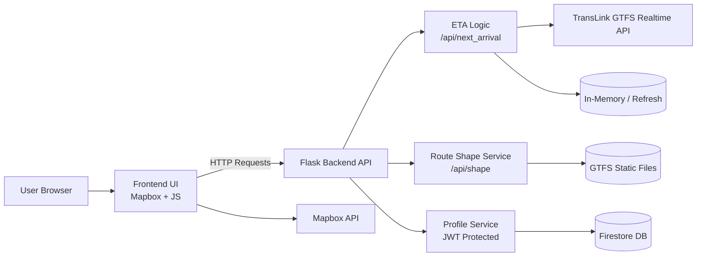

# Bus Type Transit Tracker (bt3)


## Overview

bt3 is a web application that allows users to view bus routes and track live bus types and locations using real-time transit data. It integrates mapping, live vehicle feeds, and user preferences into a single interface.

## Quickstart

1. Install uv
   [https://docs.astral.sh/uv/getting-started/installation/](https://docs.astral.sh/uv/getting-started/installation/)

2. Clone the repository

   ```bash
   git clone <repo-url>
   cd bt3
   ```

3. Set up environment variables

   ```bash
   cp .env.example .env
   ```

   Fill in your API keys.

4. Run the application

   ```bash
   uv run src/app.py
   ```

5. Open in browser

   ```
   http://localhost:8080
   ```


## Environment Variables

Create a `.env` file using the following template:

```env
MAPBOX_ACCESS_TOKEN=your_mapbox_key_here
TRANSLINK_API_KEY=your_translink_key_here
FIREBASE_APIKEY=your_secret_key_here
```


## Architecture Overview

The system follows a client–server architecture.

* Frontend: Handles map rendering, UI interactions, and visualization
* Backend: Provides API endpoints, processes transit data, and manages sessions
* External APIs: TransLink (transit data), Mapbox (map rendering)
* Storage: Firestore for user profiles and preferences


## Architecture Diagram




## API Documentation

Base URL:

```
http://localhost:8080
```

| Method | Endpoint                        | Description                                        | Parameters                       | Auth Required |
| ------ | ------------------------------- | -------------------------------------------------- | -------------------------------- | ------------- |
| GET    | `/api/next_arrival`             | Get next bus arrival time for a stop               | `stop_id`, `bus_number` (query)  | No            |
| GET    | `/stop_code/<stop_code>/shapes'`| Get route shape from stop code (GeoJSON LineString)| `stop_code` (path)               | No            |
| GET    | `/stop_code/<stop_code>`        | Get routes from stop code                          | `stop_code` (path)               | No            |
| GET    | `/trips/<trip_id>/shape`        | Get route shape from trip id (GeoJSON LineString)  | `trip_id` (path)                 | No            |
| GET    | `/api/profile/stops`            | Get all favorite stops                             | None                             | Yes (JWT)     |
| GET    | `/api/profile/stops/<fav_idx>`  | Get a specific favorite stop by index              | `fav_idx` (path)                 | Yes (JWT)     |
| POST   | `/api/profile/stops`            | Add a favorite stop                                | `stop_number` (form)             | Yes (JWT)     |
| PUT    | `/api/profile/stops/<fav_idx>`  | Update a favorite stop                             | `stop_number` (form)             | Yes (JWT)     |
| DELETE | `/api/profile/stops/<fav_idx>`  | Delete a favorite stop                             | `fav_idx` (path)                 | Yes (JWT)     |


## Features

* Real-time bus tracking with periodic refresh
* Route highlighting when hovering over buses
* Stop interaction with route visualization
* ETA lookup for specific buses and stops
* User profile with saved preferences
* Basic chart visualization of active bus types on route


## Security Notes

API keys are currently exposed in the frontend and should not be used in a public deployment. This should be addressed by moving key usage to the backend.


## Handoff Notes

* Ensure `.env` is configured before running
* The application depends on live TransLink API availability
* Session-based authentication is used
* Frontend expects specific GeoJSON formats from backend endpoints
