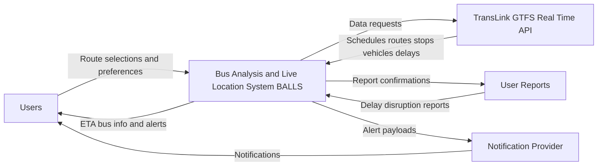
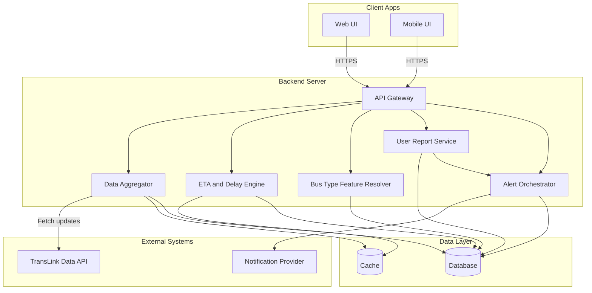
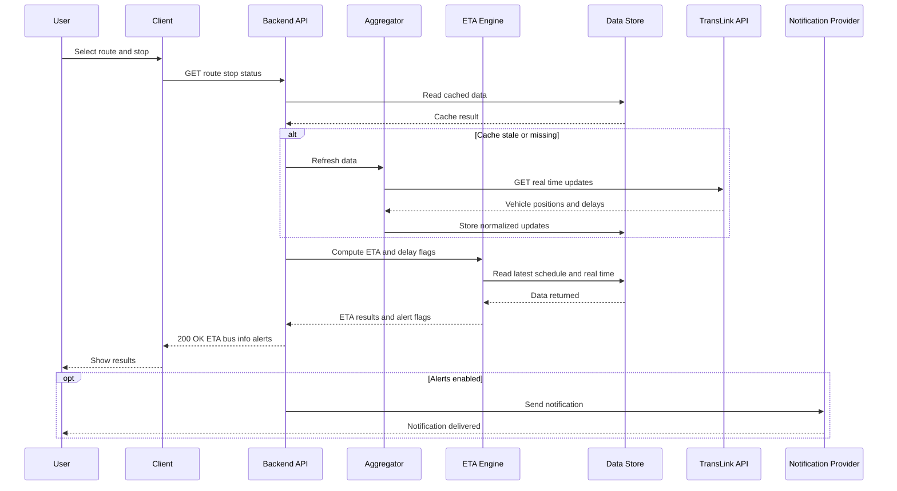

# Architecture - Bus Analysis and Live Location System BALLS

This document defines the system boundary, major components, architectural pattern, and key flows for BALLS.

---

## 1 Context Diagram

## 2 Component Diagram

## 3 Sequence Diagram

## 4 Architectural Pattern Justification
Architectural Pattern: Client–Server with Layered Architecture

The Bus Analysis & Live Location System (BALLS) follows a Client–Server architecture combined with a layered design. This pattern cleanly separates concerns between the user interface, application logic, and data access, making the system easier to develop, maintain, and scale.

The client layer (web or mobile frontend) is responsible solely for presenting information to users, such as bus routes and live location updates. It communicates with the server layer via well-defined API endpoints, ensuring the frontend remains decoupled from backend implementation details. The backend layer contains the core business logic, including processing live transit data, caching frequently updated locations, and coordinating data from external APIs. A data layer persists route information and metadata while improving performance and reliability.

This architectural choice fits the project well because real-time bus tracking requires frequent data updates, controlled access to external APIs, and predictable response times. By isolating the data-fetching logic in the backend, the system can efficiently manage caching strategies and reduce unnecessary calls to the transit data provider.

The primary trade-off is increased complexity compared to a monolithic or single-tier application. Additional layers introduce more components to manage and deploy. However, this complexity is justified by the improved scalability, testability, and flexibility, which is especially important if future features such as user accounts, notifications, or analytics are added.
